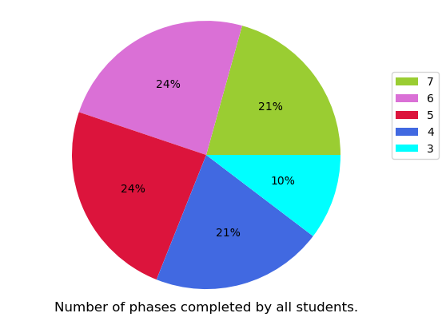
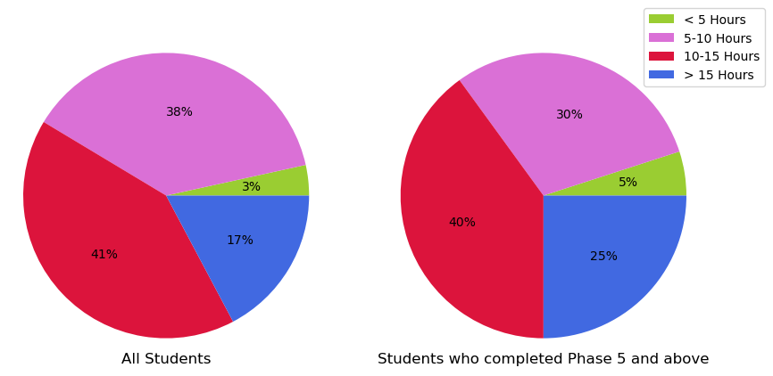
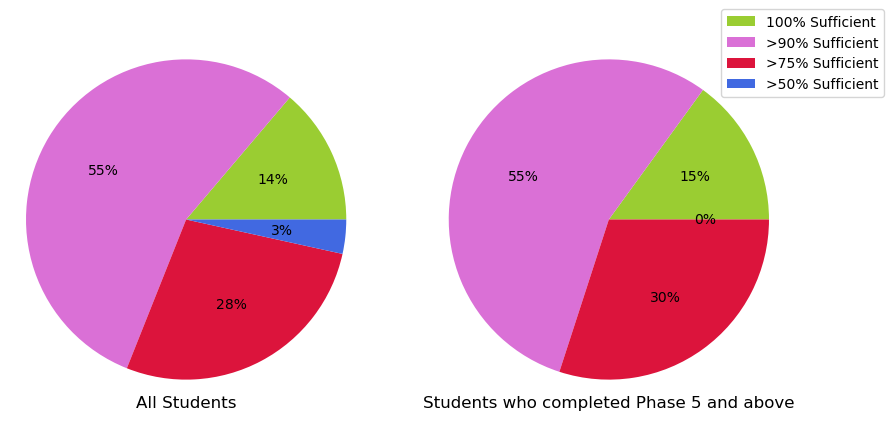
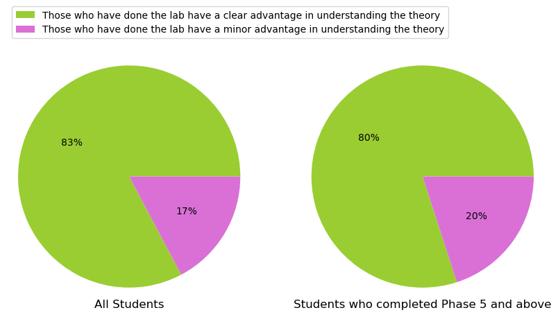
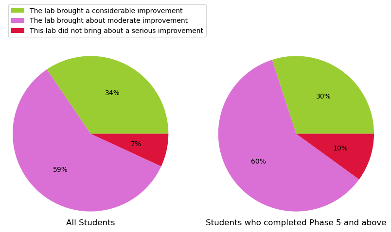
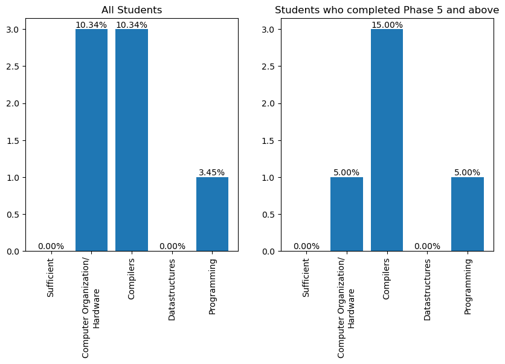

---
hide:
    - toc
---
**Aug-Nov 2023, B.Tech Semester 5, Operating Systems Laboratory, IIT Palakkad**  
**Number of respondents: 53**  
**Duration of the course: One semester (13 weeks)**  
**Type of course: Core.**  
  

A feedback questionnaire was circulated to all the students who credited the course one week before the end of the semester. The responses are summarized below

**Major phases of the Project** (Each stage subsumes the previous stages):  

*   Phase 1: Stage 12-14: Scheduling and kernel stack management
*   Phase 2: Stage 16-19: Device Handling, interrupts and Exceptions
*   Phase 3: Stage 20: Process Management
*   Phase 4: Stage 21-22: Interprocess Communication - Semaphore and Signal-Wait
*   Phase 5: Stage 23-25: File System Implementation
*   Phase 6: Stage 26: User Management and access permissions
*   Phase 7: Stage 27: Memory Management - Disk swap management

  
**Q1. Student Performance: How many phases of the project did you complete?**  
  

  
**Q2. Time Management: How many hours of work did you put into the project per week on an average to complete up to what you have done?**  
  
  
  
**Q3. Effectiveness of road map: What percentage of work could be done without having to refer to material outside the roadmap/documentation of project ?**  
  
  
**Q4. Contribution to understanding of theory: How much did the lab help to improve your understanding of Operating Systems theory?**  
  
  
**Q5. Contribution to Coding/Software development skills: How far did this lab contribute to the improvement of your coding / software development skills?**  
  
  
**Q6. Student background: Was your background sufficient for doing the lab ? If not did you feel that your knowledge in any of the following subjects was inadequate for you?**  

