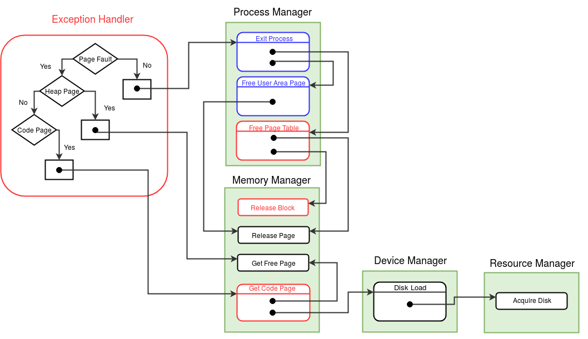

### Arguments
None

### Return value
None

### Description
If a process 1) generates an illegal instruction or an invalid address (outside its virtual address space) 2) do a division by zero 3) tries to write to a page which is read-only, 4) causes other faulty conditions which are machine dependent, the machine will generate an exception. See [Exception Handling (Tutorial)](../tutorials/xsm-interrupts-tutorial.md). The exception handler must terminate the process and invoke the context switch module to to schedule other processes. 

The exception handler is also invoked when a page required by a process is not present in the memory. This condition is known as a [page fault](http://en.wikipedia.org/wiki/Page_fault). The eXpOS scheduler will never schedule a process if its stack page is not present in the memory. Hence, a page fault can occur only when either a) one of the code pages of the process (logical pages 4 to 7) has to be loaded from the disk or b) one of the heap pages has not been allocated (logical page 2 or 3). When a page fault exception occurs, the exception handler routine checks if the page resides in the disk. If it does, it is loaded to the memory and the page table is updated. Otherwise, a new page is allocated to the process by the exception handler.

The data structures updated are [Disk Status Table](mem-ds.md#disk-status-table), [System Status Table](mem-ds.md#system-status-table), [Memory Free List](mem-ds.md#memory-free-list) and [Page Table](process-table.md#per-process-page-table).

The MODE FLAG must be set upon entering the system call and reset before returning.

<figure>
	
	<figcaption>Control flow diagram for *Exception handler*</figcaption>
</figure>
 
  

### Algorithm

<pre><code>
Set the MODE_FLAG in the <a href="../../os-design/process-table/">process table</a> entry to -1 indicate that the process is in the execption handler.

Switch to the Kernel Stack. 	/* See <a href="../../os-design/stack-smcall/">kernel stack management during system calls</a> */
Save the value of SP to the USER SP field in the <a href="../../os-design/process-table/">Process Table</a> entry of the process.
Set the value of SP to the beginning of User Area Page.

Backup the register context of the current process using the <a href="../../arch-spec/instruction-set/">BACKUP</a> instruction and push EIP onto the kernel stack.

<b>If</b> (the exception is not caused by a page fault or user stack is full)  /* Check the <a href="../../tutorials/xsm-interrupts-tutorial/">Exception Cause registers</a> */
		 Display the cause of the exception.
	     Terminate the process using <b>exit_process()</b> module function in the <a href="../../modules/module-01/">Process Manager</a> module.
	     Invoke the scheduler by calling the <b>switch_context()</b> function in the <a href="../../modules/module-05/">Scheduler Module</a>.

/* Exception is due to page fault */
Using the Exception registers, find the page number of the page causing the exception.

If (page corresponds to a code page)
	Get the disk block number to load from the <a href="../../os-design/process-table/#per-process-disk-map-table">Disk Map Table</a> entry of the process.
	Load the page to memory by calling the <b>get_code_page()</b> function in the <a href="../../modules/module-02/">Memory Manager</a> Module.
	In the <a href="../../os-design/process-table/#per-process-page-table">page table</a> entry, set the Page Number field to the page number returned by get_code_page()
	Set the <a href="../../os-design/process-table/#per-process-page-table">referenced and valid bits</a> to 1. Also set the <a href="../../os-design/process-table/#per-process-page-table">write bit</a> to 0.
	/* Code pages are not writable */
  
else if (page corresponds to a heap page)
	Allocate 2 new memory pages by calling the <b>get_free_page()</b> function in the <a href="../../modules/module-02/">Memory Manager</a> module.
	In the page table entry, set the Page Number field to the pages allocated above
	and auxiliary information to referenced and valid. Also set the write bit to 1.
	/* Heap is writable */

Pop EIP from the kernel stack and restore the register context of the process using <a href="../../arch-spec/instruction-set/">RESTORE</a> instruction.

Reset the MODE_FLAG back to 0.
Restore SP to the USER SP stored in the process table.
Increment SP and store EIP onto the location pointed to by SP.

ireturn.
</code></pre>