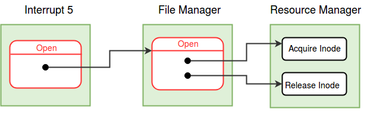

### Arguments
Filename (String) 

### Return Value

|  |  |
| --- | --- |
| File Descriptor (Integer) | Success, the return value is the file descriptor for the opened file.  |
| -1 | File not found or file is not a data or root file |
| -2 | System has reached its limit of open files |
| -3 | Process has reached its limit of resources |

### Description
For a process to read/write a file, it must first open the file. Only data and root files can be opened. The Open operation returns a file descriptor which identifies the open instance of the file. An application can open the same file several times and each time, a different descriptor will be returned by the Open operation. 

The OS associates a seek position with every open instance of a file. The seek position indicates the current location of file access (read/write). The Open system call initilizes the seek position to 0 (beginning of the file). The seek position can be modified using the [Seek system call](seek.md).

The [root file](disk-ds.md#root_file) can be opened for Reading by specifying the filename as  ***"root"***. Note that the Root file is different from the other files - It has a reserved memory page copy. So this will be treated as a special case in all related system calls. 

   
<figure>
	
	<figcaption>Control flow diagram for *Open* system call</figcaption>
</figure>

  
  

### Algorithm

<pre><code>
	Set the MODE_FLAG in the <a href="../../os-design/process-table/" target="_blank">process table</a> entry to 2, 
	indicating that the process is in the open system call.

	//Switch to Kernel Stack - See <a href="../../os-design/stack-smcall/" target="_blank">Kernel Stack Management during System Calls</a>. 
	Save the value of SP to the USER SP field in the <a href="../../os-design/process-table/" target="_blank">Process Table</a> entry of the process.
	Set the value of SP to the beginning of User Area Page.

 	

Find a free Per-Process Resource Table entry.

                Find the PID of the current process from the <a href="../../os-design/mem-ds/#ss_table" target="_blank">System Status Table</a>.
                Find the User Area page number from the <a href="../../os-design/process-table/" target="_blank">Process Table </a>entry.
                The  <a href="../../os-design/process-table/#per_process_table" target="_blank">Per-Process Resource Table</a> is located at the  <a href="../../support-tools/constants/" target="_blank">RESOURCE_TABLE_OFFSET</a> from the base of the <a href="../../os-design/process-table/#user_area" target="_blank"> User Area Page </a>.              
		Find a free <a href="../../os-design/process-table/#per_process_table" target="_blank">Resource Table</a> entry.&nbsp;&nbsp;
		If there is no free entry, return -3.  

 
	Call the <b>open()</b> function from the <a href="../../modules/module-03/" target="_blank">File Manager module</a> to get the <a href="../../os-design/mem-ds/#file_table" target="_blank">Open File table</a> entry.
		
	If Open fails, return the error code.

 	

Set the Per-Process Resource Table entry

		Set the Resource Identifier field to <a href="../../support-tools/constants/" target="_blank">FILE </a>. 
		Set the Open File Table index field to the free Open File Table entry found.	     

	Set the MODE_FLAG in the <a href="../../os-design/process-table/" target="_blank">process table</a> entry to 0.

	Restore SP to User SP.

	Return the index of the <a href="../../os-design/process-table/#per_process_table" target="_blank">Per-Process Resource Table</a> entry. &nbsp;&nbsp;/* success */
	/* The index of this entry is the File Descriptor of the file. */

</code></pre> 

!!! note
	At each point of return from the system call, remember to reset the MODE FLAG and switch back to the user stack.
  

!!! question
	Why must a free Per Process Resource Table entry be found before calling the open() module function?

!!! question
	Why should the "root" file be treated seperately? Where is this change implimented for the open system call?

!!! question 
	Why do we maintain OPEN INSTANCE COUNT in Open File table and FILE OPEN COUNT in File Status table? Why do we need two tables?

