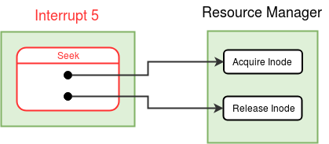

### Arguments
File Descriptor(Integer) , Offset (Integer)

### Return Value

|  |  | 
| --- | --- | 
| 0 | Success |
| -1 | File Descriptor given is invalid |
| -2 | Offset value moves the file pointer to a position outside the file |

### Description
The Seek operation allows the application program to change the value of the file pointer so that subsequent Read/Write is performed from a new position in the file. The new value of the file pointer is determined by adding the offset to the current value. (A negative Offset will move the pointer backwards). An Offset of 0 will reset the pointer to the beginning of the file. 

If a positive offset goes beyond the size of the file, the seek position will be set to the file size (in the [inode table](disk-ds.md#inode-table) entry). A negative offset leading to LSeek value below 0 will give an error.

  

<figure>
	
	<figcaption>Control flow diagram for *Seek* system call</figcaption>
</figure>

  
  

### Algorithm

<pre><code>
Set the MODE_FLAG in the <a href="../../os-design/process-table/">process table</a> entry to 6, 
indicating that the process is in the seek system call.

//Switch to Kernel Stack - See <a href="../../os-design/stack-smcall/">Kernel Stack Management during System Calls</a>. 
Save the value of SP to the USER SP field in the <a href="../../os-design/process-table/">Process Table</a> entry of the process.
Set the value of SP to the beginning of User Area Page.

If file descriptor is invalid, return -1.    /* File descriptor value must lie within the range from 0 to 7 (both included). */

Locate the Per-Process Resource Table of the current process.

                 Find the PID of the current process from the <a href="../../os-design/mem-ds/#system-status-table" target="_blank">System Status Table</a>.
                 Find the User Area page number from the <a href="../../os-design/process-table/#per_process_table" target="_blank">Process Table </a>entry.
                 The  <a href="../../os-design/process-table/#per_process_table">Per-Process Resource Table</a> is located at the  <a href="../../support-tools/constants/" target="_blank">RESOURCE_TABLE_OFFSET</a> from the base of the <a href="../../os-design/process-table/#user_area" target="_blank"> User Area Page </a>.

<b>If</b> entry in the Per Process Resource Table corresponding to the file descriptor is invalid, return -1.   
/* No file is open with this file descriptor. */

Get the index of the <a href="../../os-design/mem-ds/#open-file-table" target="_blank">Open File Table</a> entry from the Per Process Resource Table entry.

Get the index of the <a href="../../os-design/disk-ds/#inode-table" target="_blank">Inode Table</a> entry from the Open File Table entry.

Call the <b>acquire_inode()</b> function in the <a href="../../modules/module-00/">Resource Manager</a> module.   /* Lock the inode */
If the locking fails, return -1. 

Get the current Lseek position from the Open File Table entry. 

Check the validity of the given offset 

1. Get the file size of the file from the <a href="../../os-design/disk-ds/#inode-table" target="_blank">Inode Table</a> (Use 480 if inode index is "INODE_ROOT").
2. <b>If</b> (lseek + the given offset) is less than 0, <b>release_inode()</b> and return -2.

<b>If</b> the given offset is 0,
	Set lseek value in the Open File Table entry to 0.
<b>else if</b> lseek+offset is greater than the file size,
	Set the lseek value to file size. /* Check inode table for file size */
<b>else</b>
	Change the lseek value in the Per-Process Resource Table entry to lseek+offset.

Call the <b>release_inode()</b> function in the <a href="../../modules/module-00/">Resource Manager</a> module.   /* Free the inode */

Set the MODE_FLAG in the <a href="../../os-design/process-table/">process table</a> entry of the parent process to 0.
Switch back to the user stack by resoting USER SP from the process table.

Return with 0.   /* success */
</code></pre>

!!! warning "Note"
	At each point of return from the system call, remember to reset the MODE FLAG and switch back to the user stack.

!!! question "Question 1"
	What concurrency issue can occur if the inode is not locked before reading the lseek position?

!!! question "Question 2"
	What goes wrong if the LSEEK is stored in the File Status Table instead of the Open File table?

!!! question "Question 3"
	What goes wrong if the LSEEK is stored in the per-process resource table instead of the Open File table?

!!! question "Question 4"
	Which all file system calls set the FILE_SIZE field in the inode status table?

!!! question "Question 5"
	If your OS code has no bugs, acquire_inode() in the above code will never fail. Why?