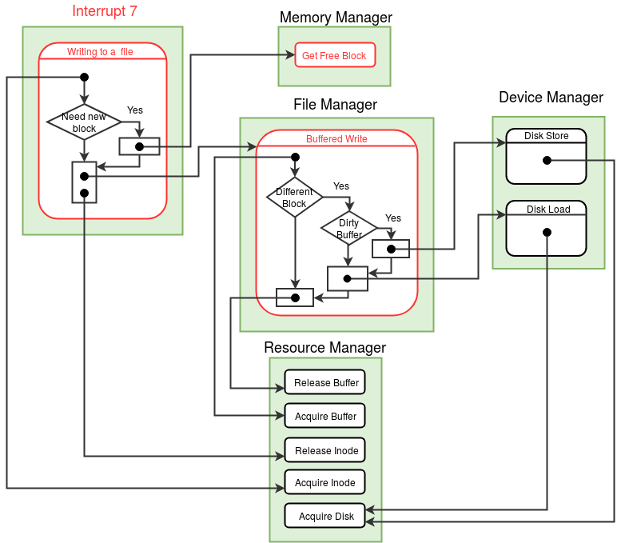

### Arguments
File Descriptor(Integer) and the word to be written

### Return Value

|  |  |
| --- | --- |
| 0 | Success |
| -1 | File Descriptor given is invalid |
| -2 | No disk space / File Full |
| -3 | Permission denied |

### Description
The file descriptor is used to identify an open instance of the file. The Write operation writes the word given as argument to the position pointed by the file pointer of the file. After each Write operation, the file pointer advances to the next word in the file. Root file and Executable files cannot be written.

:red_circle: In addition to this in  [Multiuser](../os-spec/multiuser.md) implementation, data files which are created with exclusive permission, cannot be written into by any user other than the owner, root or kernel.

<figure>
    
    <figcaption>Control flow diagram for *Write* system call</figcaption>
</figure>
  
  

### Algorithm

<pre><code>
Set the MODE_FLAG in the <a href="../../os-design/process-table/">process table</a> entry to 5, 
indicating that the process is in the write system call.

//Switch to Kernel Stack - See <a href="../../os-design/stack-smcall/">Kernel Stack Management during System Calls</a>. 
Save the value of SP to the USER SP field in the <a href="../../os-design/process-table/">Process Table</a> entry of the process.
Set the value of SP to the beginning of User Area Page.

<b>If</b> the word is to be written to STDOUT (terminal device)    /* indicated by a file descriptor value of -2 */
	     Call the <b>terminal_write()</b>function in the <a href="../../modules/module-04/" target="_blank">Device manager </a> Module .
	     Switch back to the user stack by restoring USER SP from the process table.
             Set the MODE_FLAG in the <a href="../../os-design/process-table/">process table</a> entry of the parent process to 0.
             Return 0.   /* success */
			 
/* If not terminal, write to file. */

If file descriptor is invalid, return -1.    /* File descriptor value should be within the range 0 to 7 (both included). */

Locate the Per-Process Resource Table of the current process.

                 Find the PID of the current process from the <a href="../../os-design/mem-ds/#ss_table" target="_blank">System Status Table</a>.
                 Find the User Area page number from the <a href="../../os-design/process-table/#per_process_table" target="_blank">Process Table</a> entry.
                 The  <a href="../../os-design/process-table/#per_process_table">Per-Process Resource Table</a> is located at the  <a href="../../support-tools/constants/" target="_blank">RESOURCE_TABLE_OFFSET</a> from the base of the <a href="../../os-design/process-table/#user_area" target="_blank"> User Area Page </a>.

If the Resource identifier field of the <a href="../../os-design/process-table/#per_process_table" target="_blank">Per Process Resource Table</a> entry is invalid or does not indicate a <a href="../../support-tools/constants/" target="_blank">FILE</a>, return -1.   
/* No file is open with this file descriptor. */

Get the index of the <a href="../../os-design/mem-ds/#file_table" target="_blank">Open File Table</a> entry from the Per Process Resource Table entry.

Get the index of the <a href="../../os-design/disk-ds/#inode_table" target="_blank">Inode Table</a> entry from the Open File Table entry. 

If the current user is not root and the current user does not own the file and 		/* Check the <a href="../../os-design/process-table/">process table</a> entry */
the exclusive permission is set, return -3. 

Acquire the Lock on the File by calling the <b>acquire_inode()</b> function in the <a href="../../modules/module-00/" target="_blank">File Manager</a> module.  
If acquiring the inode fails, return -1.

Get the Lseek position from the Open File Table entry.

<b>If</b> lseek position is same as the <a href="../../support-tools/constants/">MAX_FILE_SIZE</a>, <b>release_inode()</b> and return -2.  /* Maximum file size of 2048 reached*/

If the Lseek position is a multiple of 512 and the same as File size in the inode table /* New block to be allocated */
	
              Get a free disk block by calling the <b>get_free_block()</b> function in the <a href="../../modules/module-02/">Memory Manager</a> module.

              If no free disk block is found <b>release_inode()</b> and return -2. 

              Set the new disk block found in the corresponding (lseek / 512) disk block field  in the <a href="../../os-design/disk-ds/#inode_table" target="_blank">Inode table</a> entry.

Find the disk block number and the position in the block from which input is to be written.

               Get the block index from lseek position.   /* block index = lseek / block size (512) */
               Get the disk block number corresponding to the block index from the <a href="../../os-design/disk-ds/#inode_table" target="_blank">Inode Table</a> .
               Get the offset value from lseek position.   /* offset = lseek % the block size (512) */

Write the word to the File Buffer by calling the <b>buffered_write()</b> function in the <a href="../../modules/module-03/" target="_blank">Buffer Manager</a> module.

If Lseek equals file size, increment file size in the inode table entry and also in the memory copy of the <a href="../../os-design/disk-ds/#root_file">root file</a>.

Increment the Lseek position in the Open File Table entry.

Release the Lock on the File by calling the <b>release_inode()</b> function in the <a href="../../modules/module-00/" target="_blank">Resource Manager</a> module.

Switch back to the user stack by restoring USER SP from the process table.
Set the MODE_FLAG in the <a href="../../os-design/process-table/">process table</a> entry of the parent process to 0.

Return 0.   /* success */

</code></pre>

!!! warning "Note"
    At each point of return from the system call, remember to reset the MODE FLAG and switch back to the user stack.

!!! question "Question 1"
    What happens when the "root" is being written into?

!!! question "Question 2"
    Which data structure constrains the max file size to 2048 words?

!!! question "Question 3"
    What modification to the file data stuctures will enable files exceeding the max file size?

  

