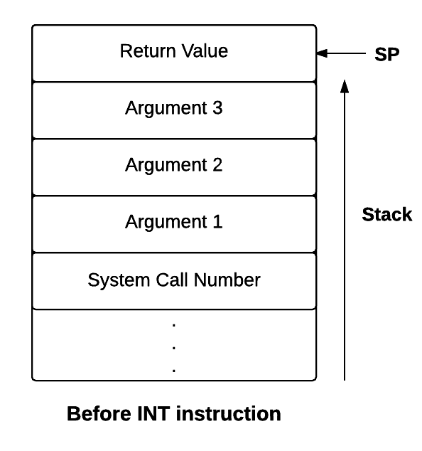
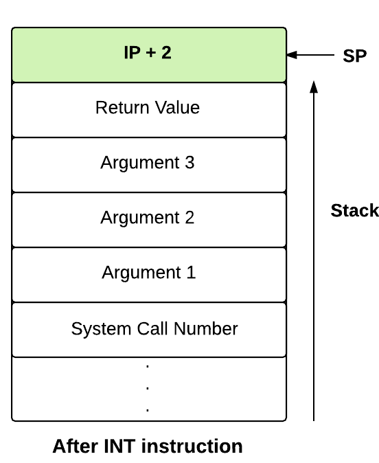

!!! note "Learning Objectives"
    - Familiarise with the [low level system call interface](../abi.md) in eXpOS.
    - Familiarise with the console output mechanism in eXpOS.

!!! abstract "Pre-requisite Reading"
    Read and understand the [Kernel Stack Management during system calls](../os-design/stack-smcall.md) before proceeding further.


In Stage 7, we wrote a user program and used the BRKP instruction to view the result in debug
mode. In this stage, we will modify the program such that the result is printed directly to the
terminal. The terminal print is acheived by issuing a write system call from the user program.
The write system call is serviced by interrupt routine 7.


#### Modifications to the user program

A system call is an OS routine that can be invoked from a user program. The OS provides system
call routines for various services like writing to a file/console, forking a process etc. Each system call routine is
written inside some software interrupt handler. For example, the write system call of eXpOS is coded inside
the INT 7 handler.An interrupt handler may contain code for several system calls.
(For example, in the eXpOS implementation on XSM, the routines for create and delete system
calls are coded inside the INT 4 handler - find details [here](../os-design/sw-interface.md)). 

To identify the correct routine, the OS assigns a unique systemcall number to each system call routine. To invoke a system call from a program, the program must pass the system call number (along with other arguments to the system call) and invoke the corresponding
software interrupt using the INT instruction. The arguments and the system call number are passed through the user
program's stack.


When a program invokes a system call, the system switches from user mode to kernel mode.
Hence, system calls run in kernel mode and thus have access to all the hardware resources. Upon completing the call, the
system call places return value of the call into designated position in the user program's stack and returns
to the calling program using the IRET. Since the IRET instruction switches mode back to user
mode, the user program resumes execution after the call in user mode. The user program extracts the return values of
the call from the user stack.

In this stage, we will write a small kernel routine for handling console write. This is part
of the functionality of the write system call (system call number 5) programmed inside the INT 7 handler. You will
implement the full functionality of the write system call in later stages.

The user program of Stage 7 is modified such that a write system call is issued to print the
contents of register R1 to the terminal. You will no longer need to run the program in debug mode.
This is because once we implement the system call service for console output, this system call
can be used by the user program to print the output to the console.
A user program must execute the following steps to invoke the system call:


1) Save the registers in use to the user stack (in the program below R0, R1, R2 are saved). As per the specification, since the user program calls system call routine , the OS expects that it saves its own context (registers in use) before issuing the system call.

2) Push the system call number and arguments to the stack. For the Write system call, the system call number is 5. Argument 1 is the file descriptor which is -2 for the terminal. Argument 2 is the word which has to be written to the terminal. Here the word we are going to 
write is present in R1. By convention, all system calls have 3 arguments. As we do not have a third argument in this case, push any register, say R0 on to the stack. (In this case the last argument will be ignored by the system call handler.) Refer to the low level system call
interface for write [here](../os-design/sw-interface.md).

3) Push any register, say R0 to allocate space for the return value.

4) Invoke the interrupt by "INT 7" instruction.

//The following code will be executed after return from the system call.

Normally, the return value of a system call gives information regarding whether the system
call succeeded or whether there was an error etc. In some cases, the system call returns a value which is to be
used later in program (for instance, the open system call returns a file descriptor). In the
present case, since console write never fails, we ignore the return value.


5) Pop out the return value, the system call number and arguments which were pushed on the
stack prior to the system call.

6) Restore the register context from the stack (in the following program R0,R1,R2 are restored).

The resulting program is given below.

```
0
2056
0
0
0
0
0
0
MOV R0, 1
MOV R2, 5
GE R2, R0
JZ R2, 2110
MOV R1, R0
MUL R1, R0

// saving register context
PUSH R0
PUSH R1
PUSH R2

// pushing system call number and arguments
MOV R0, 5
MOV R2, -2
PUSH R0
PUSH R2
PUSH R1
PUSH R0

//  pushing space for return value
PUSH R0
INT 7

// poping out return value and ignore
POP R1

// pop out argumnets and system call number and ignore
POP R1
POP R1
POP R1
POP R1

//  restoring the register context
POP R2
POP R1
POP R0

ADD R0, 1
JMP 2058

INT 10
```

Contents of the stack before and after the INT instruction

<div style="display: inline-flex;width: 100%">


</div>
Now, you will write the system call handler for processing the write request.

#### INT 7

The write operation is handled by Interrupt 7.
The word to be printed is passed from the user program through its user stack as the
second argument to the interrupt routine. The interrupt routine retrieves this word from the
stack and writes the word to the terminal using the OUT instruction.

Detailed instructions for doing so are given below

1) Set the MODE FLAG field in the [process table](../os-design/process-table.md)
to the system call number which is 5 for write system call. To get the process table of current process, use the PID obtained from the
[system status table](../os-design/mem-ds.md#system-status-table).
MODE FLAG field in the process table is used to indicate whether the current process is 
executing in a system call, exception handler or usermode.
```
[PROCESS_TABLE + [SYSTEM_STATUS_TABLE + 1] * 16 + 9] = 5;
```

2) Store the value of user SP in a register as we need it for further computations.
```
alias userSP R0;
userSP = SP;
```

3) Switch the stack from user stack to kernel stack.

- Save the value of SP in the user SP field of [Process Table](../os-design/process-table.md) entry of the process.
- Set the value of SP to beginning of the kernel stack.

Details can be found at [Kernel Stack Management during system calls](../os-design/stack-smcall.md).

4) First we have to access argument 1 which is file descriptor to check whether it is valid or
not. In user mode, logical addresses are translated to physical address by the machine using
its [address translation scheme](../arch-spec/paging-hardware.md).
Since interrupts are executed in the kernel mode, the actual physical address is used to
access memory locations. Hence to access the file descriptor (argument 1) we must calculate the physical
address of the memory location where it is stored. According to system call conventions,
userSP - 4 is the location of the argument 1. So we will manually address translate `userSP -4` (See contents of the stack after INT instruction in above image for reference).

```
alias physicalPageNum R1;
alias offset R2;
alias fileDescPhysicalAddr R3;
physicalPageNum = [PTBR + 2 * ((userSP - 4)/ 512)];
offset = (userSP - 4) % 512;
fileDescPhysicalAddr = (physicalPageNum * 512) + offset;
alias fileDescriptor R4;
fileDescriptor=[fileDescPhysicalAddr];
```

5) Check whether the file descriptor obtained in above step is valid or not. In this stage it
should be -2 because file descriptor for console is -2. (see details [here](../os-design/sw-interface.md).) Write an IF condition to check whether file descriptor is -2 or not.
```
if (fileDescriptor != -2)
then
	 //code when argument 1 is not valid
else
	 //code when argument 1 is valid
endif;
```

6) If the file descriptor is not equal to -2, store -1 as a return value. According to system
call convention, return value is stored at memory location userSP -1 in the user stack.
Calculate physical address of the return value corresponding to userSP - 1 using address
translation mechanism.
```
if (fileDescriptor != -2)
then
	 alias physicalAddrRetVal R5;
	 physicalAddrRetVal = ([PTBR + 2 * ((userSP - 1) / 512)] * 512) + ((userSP - 1) % 512);
	 [physicalAddrRetVal] = -1;
else
	 //code when argument 1 is valid
endif;
```

7) The following three steps has to be included in the else block.
Calculate physical address of the argument 2 and extract the value from it , which is the
word to be printed to the console.
```
alias word R5;
word = [[PTBR + 2 * ((userSP - 3) / 512)] * 512 + ((userSP - 3) % 512)];
```

8) Write the word to the terminal using the print instruction.
```
print word;
```

9) Set the return value as 0 indicating success. According to system call convention, return value
is stored at memory location userSP -1 in the user stack.
                          
```
alias physicalAddrRetVal R6;
physicalAddrRetVal = ([PTBR + 2 * (userSP - 1)/ 512] * 512) + ((userSP - 1) % 512);
[physicalAddrRetVal] = 0;
```

10) Outside the else block, set back the value of SP to point to top of user stack.
```
SP = userSP;
```

11) Reset the MODE FLAG field in the process table to 0. Value 0 indicates that process is
running in user mode.

```
[PROCESS_TABLE + [SYSTEM_STATUS_TABLE + 1] * 16 + 9] = 0;
```

12) Pass control back to the user program using the ireturn statement.


#### Modifications to the OS startup code

Add code in the OS startup code to load INT7 from disk to memory.

```
loadi(16,29);
loadi(17,30);
```

####   Making Things Work

!!! tip "Implementation Tip"
    From this stage onwards, you have to load multiple files using XFS-interface. To make things easier, create a
    batch file containing XFS-interface commands to load the required files and run this batch file
    using **run** command. See the usage of **run** command in [XFS-interface documentation](../support-tools/xfs-interface.md)

1. Save this file in your UNIX machine as $HOME/myexpos/spl/spl_progs/sample_int7.spl
2. Compile this program using the SPL compiler.
3. Load the compiled XSM code as INT 7 into the XSM disk using XFS Interface.
4. Run the Machine with timer disabled.

!!! note 
    Starting from the next stage, you will be writing user programs using a high level language called ExpL.
    ExpL allows you to write programs that invoke system calls using the [exposcall() function](../os-spec/dynamicmemoryroutines.md).
    The ExpL compiler will automatically generate code to translate your high level function call to a call to the
    [eXpOS library](../abi.md) and the library contains code to translate the call to an INT invocation as done
    by you in this stage. The next stage will introduce you to ExpL.

??? question " Why should we calculate the physical address of `userSP-3` and `userSP-1` seperately instead of calculating one and adding/subtracting the difference from the calculated value?"
    Suppose the physical address corresponding to logical address in `userSP` be - say 5000.
    it may not be the case that 4997 is the physical address corresponding to the logical
    address `userSP-3`. Similarly the physical address corresponding to `userSP-1` need not be 4999.
    The problem is that the stack of a process spreads over two pages and these two physical pages need
    not be contiguous. Hence, logical addresses which are close together may be far separated in physical
    memory.

!!! assignment
    Write a program to print the first 20 numbers and run the system with timer enabled.