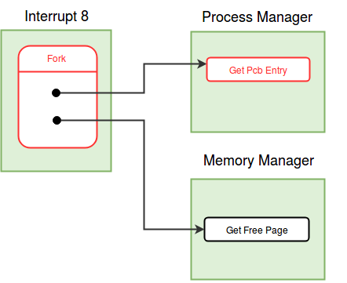
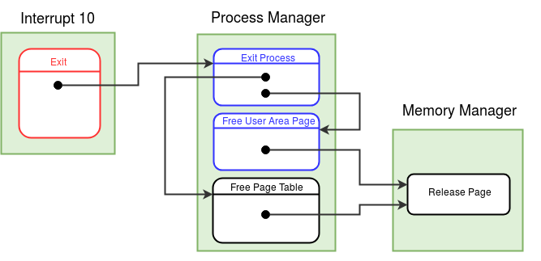

!!! note "Learning Objectives"
    - Understanding the process creation mechanism in eXpOS.
    - Implementation of fork and exit system calls.

!!! abstract "Pre-requisite Reading"
    Read and understand [eXpOS process abstraction](../os-spec/expos-abstractions.md) and [eXpOS process model](../os-spec/processmodel.md) documentation before proceeding further.

In this stage, you will learn how to create a new process using the fork system call and how
to terminate a process using the exit system call.
  
#### Fork System Call

The Fork system call spawns a new process. The new process and the process which invoked fork
have a child-parent relationship. The child process will be allocated a different PID and a new
[address space](../abi.md#virtual-address-space-model). Hence, the child process will have a different process
table and page table. However, the child and the parent will share the code and heap regions of
the address space. The child will be allocated two new stack pages and a new user area page.

The process table of the child is initialized with the same values of the parent except for
the values of TICK, PID, PPID, USER AREA PAGE NUMBER, KERNEL STACK POINTER, INPUT BUFFER, MODE
FLAG, PTBR and PTLR.The contents of the stack of the parent are
copied into the new stack pages allocated for the child.
The contents of the per process resource table in the [user area page](../os-design/process-table.md#user_area) of the parent process is copied to the child process.
However, the contents of the parent's kernel stack are not copied
to the child, and the kernel stack of the child is set to empty (that is, KPTR field in the
process table entry of the child is set to 0.)

Fork system call returns to the the parent process. The parent resumes execution from the
next instruction following the INT instruction invoking fork. Upon successful completion, fork
returns the PID of the child process to parent process.

After completion of fork, the child process will be ready for execution and will be in the
CREATED state. When the child process is scheduled (by the scheduler) to run for the first
time, it will start its execution from the immediate instruction after the call to fork. The
return value of fork to the child process is zero.
We have already noted that the child process shares the heap and code pages with the parent
process, whereas new memory pages are allocated for user stack of the child. The contents of
the parent's user stack pages are copied to the user stack of the child process.
**ExpL compiler allocates local variables, global variables and arrays of primitive data types (int,
string) of a process in the stack. Since the parent and child processes have different memory
pages for the user stack, they resume after fork with separate private copies of these
variables, with the same values.** Since the stack page is not shared between the parent
and the child, subsequent modifications to these variables by either parent or the child will
not be visible to the other.

The [Alloc()](../os-spec/dynamicmemoryroutines.md#filesystemcalls)function of eXpOS library allocates memory from the heap region of a process. Hence memory
allocated by <i>Alloc()</i> to store objects referenced by variables of user defined types in
an ExpL program will be allocated in the heap. As heap pages are shared by the parent and the
child, both processes share the memory allocated using <i>Alloc()</i>. Thus,**if the parent
had allocated memory using the Alloc() function and attached it to a variable of some
user defined type before fork, the copies of the variables in both the parent and the
child store the address of the same shared memory.**
**Since the Parent and child processes can concurrently access/modify the heap pages, they
need support from the OS to synchronize access to the shared heap memory.**eXpOS provides
support for such synchronization through systems calls for **semaphores** and
**signal handling**. These will be discussed in later stages. Even though, code and library pages
are shared among parent and child processes, synchronization is not required for these pages as
their access is read only.

!!! note
    There is a subtility to be noted here.  It can happen that
    the kernel has not allocated any heap pages for the parent process at the time
    when it invoked Fork.  This is because heap pages are allocated inside 
    the exception handler when a process generates a page fault exeception while
    trying to access the heap.  Thus a process could invoke fork before any heap 
    pages were allocated to it.  However, the eXpOS sharing semantics requires 
    that the parent and the child shares their heap pages.  Hence, to satisfy the
    heap sharing semantics, the OS needs to ensure during Fork  
    that the parent is allocated its heap pages and these pages are shared with the child.

<figure>

<figcaption>Control flow for <i>Fork</i>system call</figcaption>
</figure>

High level ExpL programs can invoke <i>fork</i> system call using the library interface
function [exposcall](../os-spec/dynamicmemoryroutines.md). Fork
has system call number 8 and it is implemented in the interrupt routine 8. Fork does not take
any arguments. Follow the description below to implement the fork system call.

**Read the description of various entries of [process table](../os-design/process-table.md)before proceeding further.**

- The first action to perform in the fork system call is to set the MODE FLAG to the system call number and switch to the kernel stack. To get a new PID for the child process, invoke the **Get Pcb Entry**function from the [process manager module](../modules/module-01.md). Get Pcb Entry returns the index of the new process table allocated for the child. This index is saved as the PID of the child. As there are only 16 process tables present in the memory, maximum 16 processes can run simultaneously. If a free process table is not available, Get Pcb Entry returns -1. In such case, store -1 as the return value in the stack, reset the MODE FLAG (to 0), switch to user stack and return to the user mode from the fork system call. When PID is available, proceed with the fork system call.

- If the heap pages are not allocated for the parent process, allocate heap pages by invoking the **Get Free Page** function of the memory manager module and set the page table entries for the heap pages of the parent process to the pages acquired. - The child process requires new memory pages for stack (two) and user area page (one). To allocate a memory page, invoke the **Get Free Page**function of the [memory manager module](../modules/module-02.md).

- The next step in the fork system call is initialization of the [process table](../os-design/process-table.md) for the child process. Copy the USERID field from the process table of the parent to the child process, as
the user (currently logged in) will be same for both child and parent. (We will discuss USERID later when we add multi-user support to eXpOS.) Similarly, copy the SWAP FLAG and the USER AREA SWAP STATUS fields. (These fields will be discussed later, when we discuss swapping
out processes from memory to the disk.) INODE INDEX for the child and the parent processes will be same, as both of them run the same program. UPTR field should also be copied from the parent process. As mentioned earlier, content of the user stack is same for both of them, so
when both of the processes resume execution in user mode, the value of SP must be the same.

- Set the MODE FLAG, KPTR and TICK fields of the child process to 0. MODE FLAG, KPTR are set to zero as the child process starts its execution from the user mode. The TICK field keep track of how long a process has been running in memory and should
be initialized to 0, when a process is created. (The TICK field will be used later to decide which process must be swapped out of memory when memory is short. The strategy will be to swap out that process which had been in memory for the longest time). PID of the parent is
stored in the PPID field of the process table of the child. [STATE](../os-design/process-table.md#state)of the child process is set to [CREATED](../support-tools/constants.md). Store the new memory page number obtained for user area page in the USER AREA PAGE NUMBER field in the process table of the child proces. PID, PTBR and PTLR fields of the child process are already initialized in the [Get Pcb Entry](../modules/module-01.md)function. It is not required to initialize
[INPUT BUFFER](../os-design/process-table.md#state).

- The [per-process resource table](../os-design/process-table.md#per-process-resource-table) has details about the open instances of the files and the semaphores currently acquired by the process. Child process shares the files and the semaphores opened by the parent process. Hence we need to copy the entries of the per-process resource table of the parent to the child. We will discuss files and semaphores in later stages. (There is a little bit more book keeping work associated with files and semaphores. Since we have not added files or semaphores so far to the OS, we will skip this work for the time being and complete the pending tasks in later stages).

- Copy the [per-process disk map table](../os-design/process-table.md#per-process-disk-map-table) of the parent to the child. This will ensure that the disk block numbers of the code pages of the parent process are copied to the child.Further, if the parent has swapped out heap pages, those will be shared by the child. (This will be explained in detail in a later stage). The eXpOS design guarentees that the stack pages and the user area page of a process will not be swapped at the time when it invokes the fork system call. Hence the disk map table entries of the parent process corresponding to the stack and user area pages will be invalid, and these entries of the child too must be set to invalid.

- Initialize the [page table](../os-design/process-table.md#per-process-page-table)of the child process. As heap, code and library pages are shared by the parent process and the child process, copy these entries (page number and auxiliary information) form the page table of the parent to the child. For each page shared, increment the corresponding share count in the [memory free list](../os-design/mem-ds.md#mem_free_list)(why do we do need to do this?). Initialize the stack page entries in the page table with the new memory page numbers obtained earlier. Note that the auxiliary information for the stack pages is same for both parent and child (why?). Copy content of the user stack pages of the parent to the user stack pages of the child word by word.

- Store the value in the BP register on top of the kernel stack of child process. This value will be used to initialize the BP register of the child process by the scheduler when the child is scheduled for the first time.
<!--The processes (child) created by <i>Fork</i>starts the execution from the instruction following call to <i>Fork</i>. So, the child process needs BP value at that point of execution. Hence, BP (BP value of parent) is stored so that when the child starts it execution for the first time, it pops the value from stack and uses it. Note that even the kernel stack has a value present, the KPTR in the process table is still set to 0.-->

- Set up return values in the user stacks of the parent and the child processes. Store the PID of the child process as return value to the parent and 0 as the return values to the child. Reset the MODE FLAG of the parent process. Switch to the user stack of the parent process and return to the user mode.

The complete version of the algorithm for the fork system call is provided [here](../os-design/fork.md).

#### Get Pcb Entry (function number = 1, [Process Manager Module](../modules/module-01.md))

The Get Pcb Entry function in the process manager, finds out a free process table entry and
returns the index of it to the caller. If no process table entry is free, it returns -1. A free
process table entry ([STATE](../os-design/process-table.md#state)field is set to
[TERMINATED](../support-tools/constants.md)) can be found out by looping through all process 
table entries. Initialize the PID to the index of the free entry. Set the STATE to [ALLOCATED](../support-tools/constants.md). Initialize PTBR to the starting address of the page table for that process (obtained
using index) and PTLR to 10. Return the index to the caller.

!!! note 
    The implementation of above **Get Pcb Entry** module function is final version.

#### Modifications to [Scheduler module](../modules/module-05.md)

The context-switch (scheduler) module is modified in this stage. The BP register of the child
has to be initiazed by the scheduler for the first time as child is in created state. Refer to
the detailed schedular algorithm [here](../modules/module-05.md).

- When the process is in created state, add folllowing steps before switching to user stack.
- Store the value in the first word of the kernel stack to the BP register.

#### Exit System Call

At the end of every process,<i>exit</i> system call is invoked to terminate the process. In
the previous stages, we had already implemented the <i>exit</i> system call. Now, we will
change the <i> exit</i> system call to invoke the module function Exit Process to terminate the
process.

<i>Exit</i> system call has to update/clear the OS data structures of the terminating process
and detach the memory pages allocated to the process from its address space. The page table
entries are invalidated. There may be other processes waiting for this process to terminate.
Exit system call must wake up these processes. (Currently, processes do not wait, we will see
this in the next stage.) <i>Exit</i>has to close the files and release the semaphores acquired
by the process. Per-process resource table has to be invalidated. Finally,<i>Exit</i>has to set 
the state of the process to TERMINATED. These tasks are done by invoking the ** ExitProcess**
function of the [process manager module](../modules/module-01.md).

<figure>

<figcaption>Control flow for<i>Exit</i>system call</figcaption>
</figure>
<i>Exit</i>system call has a system call number 10 and is implemented in the interrupt
routine 10. Follow the description given below to implement the exit system call.

- Exit system call first sets the MODE FLAG to the system call number and switches to the kernal stack.
- It then invokes the **Exit Process** function present in the process manager module. Finally, Exit system call invokes the scheduler to schedule other processes.

!!! note 
    With above changes implementation of exit system call is complete. The algorithm for exit system call is given [here](../os-design/exit.md).

#### Modifications to the Boot module
Load interrupt routine 8 from disk to memory.

#### Making things work
Compile and load interrupt routine 8, interrupt routine 10, module 2, module 5 into the disk using the XFS-interface.

??? question "Q1. How does eXpOS prevent a program running in user mode from writing to the library and code pages?"
    In the page table of every process, pages of a process have auxiliary information
    associated with them. Auxiliary information consists of 4 bits of which third bit is
    write bit. If write bit is set to 1 for a page, then the process (to which the page
    belongs) has permission to write to the corresponding page. When write bit is set to 0,
    the page has read only access. So the process can not modify the content of the page.
    For every process, write bit is set to 0 for library and code pages while initializing
    page table. When a process tries to write to a page for which write bit is 0, XSM
    machine raises [illegal memory access](../tutorials/xsm-interrupts-tutorial.md#exception_handling_in_XSM)exception. Refer about auxiliary information [here](../os-design/process-table.md#per-process-page-table).

??? question "Q2. Where does ExpL allocate memory for variables of user defined data type?"
    Variables of user defined data type are allocated memory in stack, same as any variable of primitive data type. Every variable in ExpL is allocated one word memory in stack. Variable of primitive data type saves actual data in the word that is allocated to it, but variables of user defined data type stores the starting address of the object. Alloc() library function allocates memory for an object in heap and returns the starting address. This return address is stored in the stack for corresponding variable.

??? question "Q3. Upon completion of the fork system call, the parent and the child will contain the same return IP address on the top of the user stack. The value of the user stack pointer (UPTR) will also be the same for both the processes. When the fork sytem call returns to user mode (using the IRET instruction) which process executes first - parent or child? why?"
    Fork system call returns to the parent process. IRET sets the value of IP register to the return address at the top of the stack, pointed to by the SP register. The machine translates the logical SP to physical SP using the page table pointed to by the PTBR register, which points to the page table of the parent. Subsequent instruction fetch cycles continue to proceed by translating the value of IP using the PTBR value, which points to the page table of the parent process. The parent process continues execution till a context switch occurs.

??? question "Q4. What would go wrong if the Get Pcb Entry function sets the state of a newly allocated PCB entry to CREATED instead of ALLOCATED?"
    The fork system call which invokes the Get Pcb Entry function for the child process might block before completing process creation (if the Get Free Page function finds no free page in memory and invokes the scheduler). In such case, the scheduler must not try to run the new process as its creation is not complete.

??? question "Q5. When there is a page fault for a heap page, the exception handler which you have completed in stage 19 allocates both the heap pages for the process. Suppose you modify the exception handler to allocate only one heap page corresponding to the page requested (deferring the allocation of the second page till another exception occurs), what modification would be needed to your Fork system call code?"
    eXpOS semantics requires that the parent and the child share the heap. Hence, if the parent did not have two heap pages already allocated before Fork, the pages must be allocated at the time of Fork and shared with the child. An alternate approach would be to share only the presently allocated heap page (if any) of the parent with the child and wait for a page fault in either of the processes to allocate the other page. However, in this case, care must be taken to ensure that the same page is shared between the parent and the child when one of them is allocated a heap page.

!!! note
    When all processes except IDLE are TERMINATED, our present OS will repeatedly schedule IDLE 
    and thus will be in an infinite loop. Hence you will have to Use Ctrl+C to terminate the machine. 
    We will ensure graceful shutdown from the next stage.

!!! assignment "Assignment 1"
    Write two ExpL programs even.expl and odd.expl to print the first 100 even and odd numbers respectively. Write another ExpL program that first creates a child process using Fork. Then, the parent process shall use the exec system call to execute even.xsm and the child shall execute odd.xsm. Load this program as the init program.

!!! assignment "Assignment 2"
    Write an ExpL program which creates linked list of the first 100 numbers. The program then forks to create a child so that
    the parent and the child has separate pointers to the head of the shared linked list. Now, the
    child prints the 1st, 3rd, 5th, 7th... etc. entries of the list whereas the parent prints the
    2nd, 4th, 6th, 8th....etc. entries of the list. Eventually all numbers will be printed, but in
    some arbitrary order (why?). The program is given [here](../test-programs/index.md#ll_fork). Try to read and understand the program before running it. Run the program as the INIT program. In the next stages, we will see
    how to use the sychronization primitives of the OS to modify the above program so that the
    numbers are printed out in sequential order.
    
