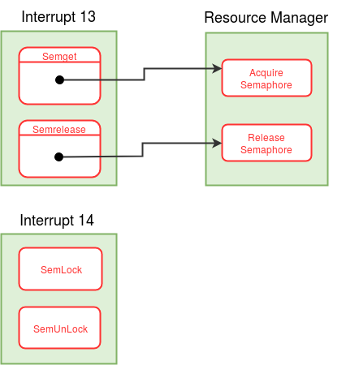

!!! note "Learning Objectives"
    - Understanding how semaphores help to solve the critical section problem.
    - Add support for semaphores to eXpOS.

!!! abstract "Pre-requisite Reading"
    Read and understand [Resource Sharing](../os-spec/expos-abstractions.md#resource-sharing-in-expos) and [Access Control](../os-spec/synchronization.md#access-control) documentations of eXpOS before proceeding further.

In this stage, we will add support for [semaphores](https://en.wikipedia.org/wiki/Semaphore_%28programming%29) to the OS. Semaphores are primitives that allow concurrent processes to handle the [critical section](https://en.wikipedia.org/wiki/Critical_section) problem. A typical instance of the critical section problem occurs when a set of processes share memory or files. Here it is likely to be necessary to ensure that the processes do not access the shared data (or file) simultaneously to ensure data consistency. eXpOS provides **binary semaphores** which can be used by user programs (ExpL programs) to synchronize the access to the shared resources so that data inconsistency will not occur.

There are four actions related to semaphores that a process can perform. Below are the actions along with the corresponding eXpOS system calls 

1. Acquiring a semaphore - _Semget_ system call  
2. Releasing a semaphore - _Semrelease_ system call  
3. Locking a semaphore - _SemLock_ system call  
4. Unlocking a semaphore - _SemUnLock_ system call

To use a semaphore, first a process has to acquire a semaphore. **When a process forks, the semaphores currently acquired by a process is shared between the child and the parent.** A process can lock and unlock a semaphore only after acquiring the semaphore. The process can lock the semaphore when it needs to enter into the critical section. After exiting from the critical section, the process unlocks the semaphore allowing other processes (with which the semaphore is shared) to enter the critical section. After the use of a semaphore is finished, a process can detach the semaphore by releasing the semaphore.

A process maintains record of the semaphores acquired by it in its [per-process resource table](../os-design/process-table.md#per-process-resource-table) . eXpOS uses the data structure, [semaphore table](../os-design/mem-ds.md#semaphore-table) to manage semaphores. Semaphore table is a global data structure which is used to store details of semaphores currently used by all the processes. The Semaphore table has 32 ( [MAX_SEM_COUNT](../support-tools/constants.md) ) entries. This means that only 32 semaphores can be used by all the processes in the system at a time. Each entry in the semaphore table occupies four words of which the last two are currently unused. For each semaphore, the PROCESS COUNT field in it's semaphore table entry keeps track of the number of processes currently sharing the semaphore. If a process locks the semaphore, the LOCKING PID field is set to the PID of that process. LOCKING PID is set to -1 when the semaphore is not locked by any process. An invalid semaphore table entry is indicated by PROCESS COUNT equal to 0\. The SPL constant [SEMAPHORE_TABLE](../support-tools/constants.md) gives the starting address of the semaphore table in the [memory](../os-implementation.md) . See [semaphore table](../os-design/mem-ds.md#semaphore-table) for more details.

The [per-process resource table](../os-design/process-table.md#per-process-resource-table) of each process keeps track of the resources (semaphores and files) currently used by the process. The per-process resource table is stored in the last 16 words of the [user area page](../os-design/process-table.md#user_area) of a process. Per-process resource table can store details of at most eight resources at a time. Hence the total number of semaphores and files acquired by a process at a time is at most eight. Each per process resource table entry contains two words. The first field, called the **Resource Identifier** field, indicates whether the entry corresponds to a file or a semaphore. For representing the resource as a file, the SPL constant [FILE](../support-tools/constants.md) (0) is used and for semaphore, the SPL constant [SEMAPHORE](../support-tools/constants.md) (1) is used. The second field stores the index of the semaphore table entry if the resource is a semaphore. (If the resource is a file, an index to the open file table entry will be stored - we will see this in later stages.) See the description of [per-process resource table](../os-design/process-table.md#per-process-resource-table) for details.

<figure>

<figcaption> Control flow for <i>Semaphore </i> system calls</figcaption>
</figure>
 
 

#### Implementation of Interrupt routine 13
The system calls Semget and Semrelease are implemented in the interrupt routine 13. Semget and Semrelease has system call numbers 17 and 18 respectively.

- Extract the system call number from the user stack and switch to the kernel stack.
- Implement system calls Semget and Semrelease according to the system call number extracted from above step. Steps to implement these system calls are explained below.
- Change back to the user stack and return to the user mode.

##### Semget System Call
**_Semget_ **system call is used to acquire a new semaphore. _Semget_ finds a free entry in the [per-process resource table](../os-design/process-table.md#per-process-resource-table) . _Semget_ then creates a new entry in the semaphore table by invoking the **Acquire Semaphore** function of [resource manager module](../modules/module-00.md) . The index of the semaphore table entry returned by Acquire Semaphore function is stored in the free entry of per-process resource table of the process. Finally, _Semget_ system call returns the index of newly created entry in the per-process resource table as **semaphore descriptor** (SEMID).

Implement _Semget_ system call using the detailed algorithm provided [here](../os-design/semaphore-algos.md#semget-system-call) .

##### Semrelease System Call
**_Semrelease_ **system call takes semaphore desciptor (SEMID) as argument from user program. _Semrelease_ system call is used to detach a semaphore from the process. _Semrelease_ releases the acquired semaphore and wakes up all the processes waiting for the semaphore by invoking the **Release Semaphore** function of [resource manager module](../modules/module-00.md) . _Semrelease_ also invalidates the per-process resource table entry corresponding to the SEMID given as an argument.

Implement _Semrelease_ system call using the detailed algorithm provided [here](../os-design/semaphore-algos.md#semrelease-system-call).

!!! note
    If any semaphore is not released by a process during execution using <i>Semrelease</i>
    system call, then the semaphore is released at the time of termination of the process in
    <i>Exit</i> system call.

#### Acquire Semaphore (function number = 6, [resource manager module](../modules/module-00.md))

**Acquire Semaphore** function takes PID of the current process as argument. _Acquire Semaphore_ finds a free entry in the semaphore table and sets the PROCESS COUNT to 1 in that entry. Finally, _Acquire Semaphore_ returns the index of that free entry of semaphore table.

Implement _Acquire Semaphore_ function using the detailed algorithm provided in resource manager module link above.

#### Release Semaphore (function number = 7, [resource manager module](../modules/module-00.md))

**Release Semaphore** function takes a semaphore index (SEMID) and PID of a process as arguments. If the semaphore to be released is locked by current process, then _Release Semaphore_ function unlocks the semaphore and wakes up all the processes waiting for this semaphore. _Release Semaphore_ function finally decrements the PROCESS COUNT of the semaphore in its corresponding semaphore table entry.

Implement _Release Semaphore_ function using the detailed algorithm provided in resource manager module link above.

#### Implementation of Interrupt routine 14

The system calls <i>SemLock</i> and <i> SemUnLock</i> are implemented in the interrupt routine
14.<i>SemLock</i>and <i>SemUnLock</i> has system call numbers 19 and 20 respectively.

- Extract the system call number from the user stack and switch to the kernel stack.
- Implement system calls SemLock and SemUnLock according to the system call number extracted from above step. Steps to implement these system calls are explained below.
- Change back to the user stack and return to the user mode.

##### SemLock System Call
**SemLock**system call takes a semaphore desciptor (SEMID) as an argument from user program. A process locks the semaphore it is sharing using the <i>SemLock</i> system call. If the requested semaphore is currently locked by some other process, the current
process blocks its execution by changing its [STATE](../os-design/process-table.md#state)
to the tuple (WAIT_SEMAPHORE, semaphore table index of requested semaphore) until the requested 
semaphore is unlocked. When the semaphore is unlocked, then STATE of the current process is made READY 
(by the process which has unlocked the semaphore).When the current process is scheduled and the 
semaphore is still unlocked the current process locks the semaphore by changing the LOCKING PID in the
semaphore table entry to the PID of the current process. When the process is scheduled but finds that 
the semaphore is locked by some other process, current process again waits in the busy loop until the requested
semaphore is unlocked.

Implement <i>SemLock</i> system call using the detailed algorithm provided [here](../os-design/semaphore-algos.md#semlock-system-call).

##### SemUnLock System Call

**SemUnLock** system call takes a semaphore desciptor (SEMID) as argument. A
process invokes<i>SemUnLock</i> system call to unlock the semaphore.
<i>SemUnLock</i> invalidates the LOCKING PID field (store -1) in the semaphore table entry for the semaphore.
All the processes waiting for the semaphore are made READY for execution.

Implement <i>SemUnLock</i> system call using the detailed algorithm provided [here](../os-design/semaphore-algos.md#semunlock-system-call).

!!! note
    The implementation of **Semget** , **Semrelease** , **SemLock** , **SemUnLock** system calls and **Acquire Semaphore** , **Release Semaphore** module functions are final.

#### Modifications to <i>Fork</i>system call

In this stage, <i>Fork</i>is modified to update the semaphore table for the semaphores
acquired by the parent process. When a process forks, the semaphores acquired by the parent
process are now shared between parent and child. To reflect this change, PROCESS COUNT field is
incremented by one in the semaphore table entry for every semphore shared between parent and
child. Refer algorithm for [fork system call](../os-design/fork.md).

- While copying the per-process resource table of parent to the child process do following -
- If the resource is semaphore (check the Resource Identifier field in the [per-process resource table](../os-design/process-table.md#per-process-resource-table)), then using the sempahore table index, increment the PROCESS COUNT field in the
[semaphore table](../os-design/mem-ds.md#semaphore-table)entry.

#### Modifications to Free User Area Page (function number = 2, [process manager module](../modules/module-01.md))

The user area page of every process contains the [per-process resource table](../os-design/process-table.md#per-process-resource-table) in the last 16 words. When a process terminates, all the semaphores the process has acquired (and haven't released explicitly) have to be released. This is done in the <i>Free User Area Page</i> function. The**ReleaseSemaphore**
function of resource manager module is invoked for every valid semaphore in the per-process resource table of the process.

- For each entry in the per-process resource table of the process do following -
- If the resource is valid and is semaphore (check the Resource Identifier field in the [per-process resource table](../os-design/process-table.md#per-process-resource-table) ), then invoke** Release Semaphore ** function of
[resource manager module](../modules/module-00.md) .

!!! note 
    **Fork** system call and **Free User Area Page** function will be further modified in later stages for the file resources

#### Modifications to boot module
- Initialize the [semaphore table](../os-design/mem-ds.md#semaphore-table) by setting PROCESS COUNT to 0 and LOCKING PID to -1 for all entries.
- Load interrupt routine 13 and 14 from the disk to the memory. See [memory organisation](../os-implementation.md).

#### Making things work
Compile and load the newly written/modified files to the disk using XFS-interface.

??? question "Q1. When a process waiting for a sempahore is scheduled again after the sempahore is unlocked, is it possible that the process finds the sempahore still locked?"
    Yes, it is possible. As some other process waiting for the semaphore could be scheduled before the current process and could have locked the semaphore. In this case the present process finds the semaphore locked again and has to wait in a busy loop until the required sempahore is unlocked.

??? question "Q2. A process first locks a semaphore using SemLock system call and then forks to create a child. As the semaphore is now shared between child and parent, what will be locking status for the semaphore?"
    The sempahore will still be locked by the parent process. In Fork system call, the PROCESS COUNT in the semaphore table is incremented by one but LOCKING PID field is left untouched.

!!! assignment "Assignment 1"
    The reader-writer program given [here](../test-programs/test-program-04.md) has two writers and one reader. The parent process will create two child processes by invoking fork. The parent and two child processes share a buffer of one word. At a time only one process can read/write to this buffer. To acheive this, these three processes use a shared semaphore. A writer process can write to the buffer if it is empty and the reader process can only read from the buffer if it is full. Before the word in the buffer is overwritten the reader process must read it and print the word to the console. The parent process is the reader process and its two children are writers. One child process writes even numbers from 1 to 100 and other one writes odd numbers from 1 to 100 to the buffer. The parent process reads the numbers and prints them on to the console. Compile the program given in link above and execute the program using the shell. The program must print all numbers from 1 to 100, but not necessarily in sequential order.

!!! assignment "Assignment 2"
    The ExpL programs given [here](../test-programs/test-program-13.md) describes a parent.expl program and a child.expl program. The parent.xsm program will create 8 child processes by invoking Fork 3 times. Each of the child processes will print the process ID (PID) and then, invokes the Exec system call to execute the program "child.xsm". The child.xsm program stores numbers from PID\*100 to PID\*100 + 9 onto a linked list and prints them to the console (each child process will have a seperate heap as the Exec system call alocates a seperate heap for each process). Compile the programs given in the link above and execute the parent program (parent.xsm) using the shell. The program must print all numbers from PID\*100 to PID\*100+9, where PID = 2 to 9, but not necessarily in sequential order. **Also, calculate the maximum memory usage, number of disk access and number of context switches** (by modifying the OS Kernel code).

!!! assignment "Assignment 3"
    The two ExpL programs given [here](../test-programs/test-program-14.md) perform merge sort in two different ways. The first one is done in a sequential manner and the second one, in a concurrent approach. Values from 1 to 64 are stored in decreasing order in a linked list and are sorted using a recursive merge sort function. In the concurrent approach, the process is forked and the merge sort function is called recursively for the two sub-lists from the two child processes. Compile the programs given in the link above and execute each of them using the shell. The program must print values from 1 to 64 in a sorted manner. Also, calculate **the maximum memory usage, number of contexts switches and the number of switches to KERNEL mode.**