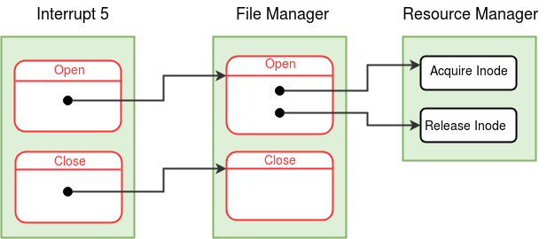
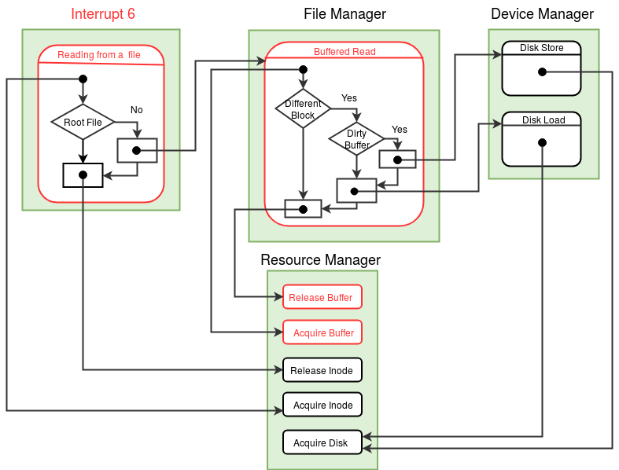

!!! note "Learning Objectives"
    - Understanding buffer cache.
    - Implementation of *Open* , *Close* and *Read* system calls.
    
!!! abstract "Pre-requisite Reading"
    Description of data structures - [File(inode) status table](../os-design/mem-ds.md#file-inode-status-table) , [Buffer table](../os-design/mem-ds.md#buffer-table) , [Open file table](../os-design/mem-ds.md#open-file-table) and [per-process resource table](../os-design/process-table.md#per-process-resource-table).
    
In this stage, we will understand the mechanism of opening and closing a file with the help of *Open* and *Close* system calls. We will also understand how contents of a file can be read by using *Read* system call. *Fork* system call and **Free User Area Page** function of process manager module are also modified in this stage.

#### Interrupt routine 5

The system calls *Open* and *Close* are implemented in the interrupt routine 5. *Open* and *Close* have system call numbers 2 and 3 respectively. From ExpL programs, these system calls are called using [exposcall function](../os-spec/dynamicmemoryroutines.md) .

<figure>

<figcaption>Control flow for <i>Open</i> and <i>Close</i> system calls</figcaption>
</figure>

##### Open system call

*Open* system call takes a filename as an argument from the user program. To perform read/write operations on a file, a process must open the file first. *Open* system call creates a new **open instance** for the file and returns a **file descriptor** (index of the new [per-process resource table](../os-design/process-table.md#per-process-resource-table) entry created for the open instance). Further operations on the open instance are performed using this file descriptor. A process can open a file several times and each time a different open instance (and new descriptor) is created. The global data structure, [Open file table](../os-design/mem-ds.md#open-file-table) keeps track of all the open file instances in the system. (A new entry is created in this table whenever the *Open* system call is invoked with any file name.) [File status table](../os-design/mem-ds.md#file-inode-status-table) is a global data structure that maintains an entry for every file in the system (not just opened files).

*Open* system call creates new entries for the file to be opened in the per-process resource table and the open file table. A process keeps track of an open instance by storing the index of the open file table entry of the instance in (the corresponding) resource table entry. When a file is opened, the OPEN INSTANCE COUNT in the open file table is set to 1 and **seek** position is initialized to the starting of the file (0).

Each time when a file is opened, the FILE OPEN COUNT in the file status table entry for the file is incremented by one. *Open* system call invokes **Open** function of [file manager module](../modules/module-03.md) to deal with global data structures - [file status table](../os-design/mem-ds.md#file-inode-status-table) and [open file table](../os-design/mem-ds.md#open-file-table) . When a process executes a *Fork* system call, the open instances of files (and semaphores) created by the process are shared between the current process and its child. As an effect of *Fork* , the OPEN INSTANCE COUNT in the open file table entry corresponding to the open instance is incremented by one.

It is necessary not to be confused between FILE OPEN COUNT (in the file status table) and OPEN INSTANCE COUNT (in the open file table). The former keeps track of the global count of how many times *Open* system call has been invoked with each file in the system - that is the number of open instances of a file at a given point of time. This count is decremented each time when a *Close* is invoked on the file by any process. Each open instance could be further **shared** between multiple processes (via *Fork* ). OPEN INSTANCE COUNT value of a particular open instance essentially keeps track of this "share count".

Implement *Open* system call using the detailed algorithm provided [here](../os-design/open.md) .

  
##### Close system call

When a process no longer needs to perform read/write operations on an open instance of a file, the open instance may be closed using the *Close* system call. Even if a process does not explicitly close an open instance by invoking *Close* system call, the open instance is closed at the termination of the process by *Exit* system call.

*Close* system call takes a file descriptor (index of the [per-process resource table](../os-design/process-table.md#per-process-resource-table) entry) as argument from the user program. *Close* system call invalidates the per-process resource table entry (corresponding to given file descriptor) by storing -1 in the Resource Identifier field. To decrement share count of the open instance in the [open file table](../os-design/mem-ds.md#open-file-table) and update the [file status table](../os-design/mem-ds.md#file-inode-status-table) accordingly, **Close** function of [file manager module](../modules/module-03.md) is invoked by the *Close* system call.

Implement *Close* system call using the detailed algorithm provided [here](../os-design/close.md) .

  
#### **Open (function number = 3, [file manager module](../modules/module-03.md) )**

**Open** function is invoked by *Open* system call to update the [file status table](../os-design/mem-ds.md#file-inode-status-table) and the [open file table](../os-design/mem-ds.md#open-file-table) when a file is opened. Open takes a file name as an argument. This function locates the inode index for the file in the [inode table](../os-design/disk-ds.md#inode-table) and **locks the inode** before proceeding further. **Acquire Inode** function of [resource manager module](../modules/module-00.md) is invoked to lock the file. Locking the file is necessary to make sure that no other process tries to delete the file concurrently. Open function creates a new entry in the open file table and returns the index of this entry to the caller. (Note that this index recieved as return value is stored in the per-process resource table entry by the *Open* system call.) All the fields of the open file table entry are initialized. In case the file is "root" file, INODE INDEX field is initialized to the [INODE\_ROOT](../support-tools/constants.md) (0). Open function increments the FILE OPEN COUNT field by one in the file status table entry for the file, except if the file is "root" file. (FILE OPEN COUNT is irrelevent for the root file as the root file is pre-loaded into the memory at boot time and can never be deleted.) The lock on the file is released by invoking **Release Inode** function of [resource manager module](../modules/module-00.md) before returning to the caller.

Implement *Open* function using the detailed algorithm given in the file manager module link above.

  
#### **Close (function number = 4, [file manager module](../modules/module-03.md) )**

**Close** function is invoked by the *Close* system call to update the [file status table](../os-design/mem-ds.md#file-inode-status-table) and the [open file table](../os-design/mem-ds.md#open-file-table) when a file is closed. Close takes an open file table index as argument. *Close* function decrements the share count (i.e OPEN INSTANCE COUNT field in the [open file table](../os-design/mem-ds.md) entry) as the process no longer shares the open instance of the file. When the share count becomes zero, this indicates that all processes sharing that open instance of the file have closed the file. Hence, open file table entry corresponding to that open instance of the file is invalidated by setting the INODE INDEX field to -1 and the open count of the file (FILE OPEN COUNT field in [file status table](../os-design/mem-ds.md#file-inode-status-table) entry) is decremented.

Implement *Close* function using the detailed algorithm given in the file manager module link above.

  
#### **Modifications to *Fork* system call**

There is a simple modification required to the *Fork* System call. When a process forks to create a child process, the file instances currently opened by the parent are now shared between child and parent. To reflect this change, the OPEN INSTANCE COUNT field in the [open file table](../os-design/mem-ds.md#open-file-table) is incremented for each open file instance in the per-process resource table of parent process.

-   While Copying the [per-process resource table](../os-design/process-table.md#per-process-resource-table) of parent to the child process do following -
-   If the resource is a file (check the Resource Identifier field in the per-process resource table), then using the open file table index, increment the OPEN INSTANCE COUNT field in the [open file table](../os-design/mem-ds.md#open-file-table) entry.
/\*The change in *Fork* system call to update the [semaphore table](../os-design/mem-ds.md#semaphore-table) , is already done in stage 22\*/

  
  
#### **Modifications to Free User Area Page (function number = 2, [process manager module](../modules/module-01.md) )**

When a process terminates, all the files the process has opened (and haven't closed explicitly) have to be closed. This is done in the Free User Area page function. The **Close** function of the [file manager module](../modules/module-03.md) is invoked for every open file in the per-process resource table of the process.

-   For each entry in the [per-process resource table](../os-design/process-table.md#per-process-resource-table) of the process, do following -
-   If the resource is valid and is file (check the Resource Identifier field in the per-process resource table), then invoke the Close function of the [file manager module](../modules/module-03.md) .
/\*The change in the Free User Area Page to release the unrelased semaphores is already done in stage 22\*/

  

`Note :` The implementation of ***Open*** , ***Close*** , ***Fork*** system calls and **Open** , **Close** , **Free User Area Page** functions are final.

  
#### Interrupt routine 6 ( *Read* system call)  
  

Interrupt routine 6 written in stage 16 reads data (words) only from the terminal. In this stage, *Read* system call is modified to read data from files. *Read* system call has system call number 7. From ExpL programs, *Read* system call is called using [exposcall function](../os-spec/dynamicmemoryroutines.md) .

<figure>

<figcaption>Control flow for reading a word from a file  </figcaption>
</figure>

##### ***Read* system call**

*Read* system call takes as input a file descriptor and the address of a word into which data should be read. *Read* system call locks the inode (corresponding to the file descriptor) at the beginning of the system call and releases the lock at the end of the system call. The functions **Acquire Inode** and **Release Inode** of [resource manager module](../modules/module-00.md) are used to lock and release the inode respectively.

*Read* system call reads the word at the position pointed to by the value of LSEEK (in the [open file table](../os-design/mem-ds.md#open-file-table) entry) and stores it into the memory address provided as input. After reading the word from the file, LSEEK is incremented by one.

As file data is stored in the disk blocks allocated to the file, in order to read from position pointed to by LSEEK, the disk block containing the word pointed to by LSEEK has to be loaded first into the memory. eXpOS maintains a **buffer cache** (see [memory organization](../os-implementation.md) )that can store up to four disk blocks in memory simultaneously. The cache pages are numbered 0,1,2 and 3 and are stored in memory pages 71, 72, 73 and 74. The simple caching scheme we user here is the following. If we want to bring disk block *N* into memory, the cache page *N mod 4* will be used. Hence, if the disk block number to be loaded is - say 195 - then the cache page number to which the block will be noded is 3 and hence, the block will be loaded to page number 74. The functions **Buffered Read** and **Buffered Write** of the [file manager module](../modules/module-03.md) are designed to handle buffer management. *Read* invokes **Buffered Read** function to bring the required disk block into the memory buffer and read the word present at position LSEEK.

**Reading from the root file does not require a buffer, as root file is already loaded into the memory at boot-time.** Memory copy of the root file is present in memory page 62 and the start address of this page is denoted by the SPL constant [ROOT\_FILE](../support-tools/constants.md) . The word in the root file at LSEEK position is copied into the address provided. Note that the memory address provided as argument is a logical address, and as system call runs in kernel mode logical address should be translated to physical address before storing data.

*Read* system call needs to lock the resources - Inode (file), buffer and disk before using them. These are locked in the order 1) Inode 2) buffer and 3) disk and released in the reverse order. This order is also followed while writing to a file. Ordering of resource acquisition is imposed in order to avoid processes getting into **circular wait** for resources. Avoiding circular wait prevents [deadlocks](https://en.wikipedia.org/wiki/Deadlock) .

Implement *Read* system call using detailed algorithm provided [here](../os-design/read.md) .

  
#### **Buffered Read (function number = 2, [file manager module](../modules/module-03.md) )**

**Buffered Read** takes as input 1) a disk block number, 2) an offset value and 3) a physical memory address. The task of Buffered read is to read a word at position specified by the offset within the given disk block and store it into the given **physical** memory address. To read a word from a disk block, it has to be present in the memory. **[Memory buffer cache](../tutorials/filesystem-implementation.md#4-memory-buffer-cache)** is used for this purpose. The disk block is loaded (if not loaded already) into the buffer page with buffer number given by formula - *(disk block number%4)* .

To use a buffer page, it has to be locked first by invoking **Acquire Buffer** function of [resource manager module](../modules/module-00.md) . To load a disk block into a memory buffer page, **Buffered Read** invokes the function **Disk Load** of the [device manager module](../modules/module-04.md) . After loading the given disk block into the corresponding buffer, the word present at the given offset in the memory buffer is copied into the address given as argument.

The buffer page to which a disk block has to be loaded may contain some other disk block. In such case, if the buffer page has been modified earlier ( **dirty bit** in the buffer table is set), the disk block present in the buffer has to be stored back into the disk before loading a new disk block. To store a disk block back into the disk, Buffered Read invokes **Disk Store** function of device manager module.

After completion of the read operation, Buffered Read unlocks the buffer page by invoking **Release Buffer** function of resource manager module . Now that the buffer is unlocked, other processes are allowed to use the buffer.

Implement Buffered Read function using the detailed algorithm given in the file manager module link above.

  
####  **Acquire Buffer (function number = 1, [resource manager module](../modules/module-00.md) )**

**Acquire Buffer** takes a buffer number and PID of a process as arguments. This function is invoked by the **Buffered Read** and **Buffered Write** functions of the [file manager module](../modules/module-03.md) to lock a buffer before its use. A process needs to acquire a buffer before accessing it to prevent data inconsistency that may arise if other processes are allowed to access the buffer concurrently.

Acquire Buffer locks a buffer by storing the given PID in the LOCKING PID field of the [buffer table](../os-design/mem-ds.md#buffer-table) entry corresponding to the given buffer number. If the required buffer is locked by some other process (some other process has set the LOCKING PID), then the process with the given PID is blocked ( [STATE](../os-design/process-table.md#state) is changed to (WAIT\_BUFFER, buffer number) in the [process table](../os-design/process-table.md) ). The process waits in the blocked state, until the required buffer is free. When the process which has acquired the buffer releases the buffer by invoking **Release Buffer** function (described next), the state of this blocked process is made READY and **Acquire Buffer** attempts to lock the buffer again.

Implement Acquire Buffer function using the detailed algorithm given in the resource manager module link above.

  
#### **Release Buffer (function number = 2, [resource manager module](../modules/module-00.md) )**

A process uses the **Release Buffer** function to release a buffer page that it has acquired earlier.

**Release Buffer** takes as input the number of a buffer page to be released and the PID of a process. Release Buffer function invalidates the LOCKING PID field (store -1) in the buffer table entry corresponding to the given buffer number. Release Buffer also wakes up all processes waiting for the buffer with given buffer number by changing the STATE in the [process table](../os-design/process-table.md) from tuple (WAIT\_BUFFER, buffer number) to READY.

Implement Release Buffer function using the detailed algorithm given in the resource manager module link above.

!!! note 
        The implementation of ***Read*** system call and **Buffered Read** , **Acquire Buffer** , **Release Buffer** functions are final.

  
#### Modifications to boot module 
- Load interrupt routine 5 and module 3 from the disk to the memory. See the memory organization [here](../os-implementation.md) .
- Initialize all entries of the [open file table](../os-design/mem-ds.md#open-file-table) by setting INODE INDEX field to -1 and OPEN INSTANCE COUNT field to 0.

  
#### Making things work
Compile and load the newly written/modified files to the disk using XFS-interface.

  
!!! assignment "Assignment 1"
    Write an ExpL program to take file name as input from the console, read the contents of the file and print to the console. Run this program using shell. Load external data files needed for the program using XFS-interface, as at present eXpOS does not support writing to a file. Check the program with following data files as input - 1) sample.dat from stage 2, 2) "numbers.dat" containing numbers 1 to 2047 separated by new line. (You may write a C program to generate the file "numbers.dat".)  

!!! assignment "Assignment 2"
    Run the program provided [here](../test-programs/index.md#test-program-5) using shell. Use data files from previous question as input. The program takes name of a data file as input and opens the file first. It then forks to create child process. The content of the file with shared open instance (shared LSEEK) will be printed to the terminal concurrently by parent and child. A semaphore is used to synchronize the use of the open instance between parent and child.