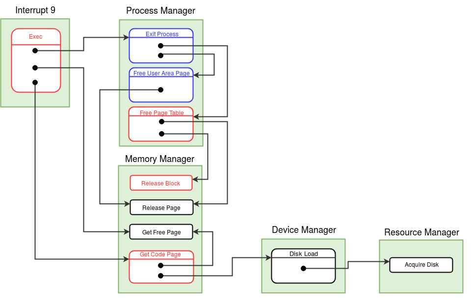

!!! note "Prerequisites"
    It is necessary to read the following documentations before starting with this tutorial.

    1. eXpOS process - [user level specification](../os-spec/processmodel.md).
    2. [Program level interface](../os-spec/systemcallinterface.md#process-system-calls) to different process system calls
    3. eXpOS [ABI](../abi.md).
    4. [XSM unprivileged](xsm-unprivileged-tutorial.md) mode execution tutorial.

When a program is loaded from the disk and executed by the ​_Exec_​ system call, the system call code loads the program into memory and sets up the ​_address space_​ for a process. A process in execution can spawn more processes using the ​_Fork_​ system call. A process is terminated using the ​_Exit_​ system call. This tutorial will focus on the data structures related to the implementation of these system calls.

In order to manage processes, the OS needs to arrange memory for two categories of data:

a)​ The space to store the process. Stated technically, the OS must allocate ​**physical memory pages**​ into which the logical address space of the process must be mapped into. The OS maintains a **per-process page table**​ for keeping track of the physical memory to logical memory mapping. The OS also allocates a ​**user area page**​ for each process to create space for a kernel stack for the process. (to be described below).

b)​ The space to store ​ metadata ​ related to each process. The data structures for meta-data are 1. ​**process table​**, 2.​ **per-process resource tables**​ and 3. ​**Per-process disk map tables​**. (Strictly speaking, per-process page tables contain metadata, and should have been listed here, but the explanation is easier with the present ordering.)

Before, getting to these data structures, we need to have a quick look into how an executable program is stored in the disk and how the OS maintains metadata of executable programs in the disk.

---

The OS maintains in the disk a global data structure called ​[Inode table](../os-design/disk-ds.md)​ in which each file in the disk has an entry. The only way in which an executable file can be loaded into the eXpFS disk is to load it externally using ​_xfs-interface_. Hence, the Inode table entry for an executable file is set when the file is loaded into the disk by _xfs-interface_​ to the following values.

a)​ File type will be set to EXEC. 
b) Name of the file as given,
c) Size of the file calculated from the content size 
c) User Id of the owner of the file – will be set to 0 (Kernal), 
d) File permissions – will not be set (eXpOS does not permit application programsto modify/delete executable files using OS system calls)
e) Disk blocks into which xfs-interface places the contents of the file. The maximum number of blocks for an executable file is 4.

The values of _file size_​ of the file and disk blocks containing the file are of relevance to process management.

Now we describe how the OS manages processes in memory.

### Physical Memory

An XEXE executable file will contain the ​**code**​ of the program (along with a small eight word **​header​** in the beginning). As noted above, the size of an executable file is limited to maximum 4 disk blocks. Hence, to load the contents of an executable file into memory, the OS will need to allocate a maximum 4 pages of physical memory.

To understand how memory allocation for a program is done, we look at the ​**Exec system call**.​ The ​_Exec_​ system call takes as argument an executable file’s name and allocates memory for loading the executable file. It then loads the program into the allocated memory and sets it up for execution.

When the loaded code is executed, the code will require more memory. Hence, each process is given a ​**memory address space**​ called the logical or virtual address space of the process. The eXpOS ABI stipulates that the address space of a process starts from logical address 0 and ends at logical address 5119 (10 pages – numbered logical page 0 to logical page 9 of the process.)

Physical pages are allocated using ​_GetFreePage_ ​function of the ​[Memory Manager Module](../modules/module-02.md). The memory pages allocated to a process need not be contiguous. Hence, ​**there must be a table for each process that describes the mapping of logical pages to physical pages**.​ This table is called the ​**per-process page table​**. The code of the executable program will contain reference to logical addresses, which has to be translated to physical addresses when the program is executed. This translation is done by the ​[paging hardware​](../arch-spec/paging-hardware.md) of the XSM machine. This documentation assumes that the user is familiar with paging hardware (see [XSM tutorial](../arch-spec/index.md) for more details). Hence, we will not describe page tables or the details of paging here. What is important here is the fact that the mapping of logical pages to physical pages is maintained in the per-process page table.

The OS expects that the application program logically divides the 10 page logical address space of a process into four parts a) ​**library**​ (logical pages 0 and 1), b) ​**heap** (logical pages 2, 3), c) ​**code**​ (or sometimes called “text” in OS jargon) (logical pages 4,5,6,7) and d) ​**stack**​ (logical pages 8,9). (These conventions are listed out in the [ABI documentation](../abi.md) and application programs (or program compilers) are expected to follow these regulations when preparing the executable file).

The ​_Exec_ system call uses the ​_DiskLoad_ function of the ​[Device Manager Module](../modules/module-04.md)​ to load the contents of the executable file specified into logical pages 4,5,6 and 7. (That is, the disk blocks will be loaded to the physical pages corresponding to these logical pages). Logical pages 0 and 1 are mapped to the eXpOS ​[run time library​](../abi.md). The OS pre-loads the library into memory pages 63 and 64 at boot time. The ​_Exec_ system call sets the page table entries for the logical pages 0 and 1 of each process to physical pages 63 and 64. Pages are allocated using the _GetFreePage_​ function of the ​Memory Manager Module​ for stack and heap regions of memory during program loading.

<figure>
    
    <figcaption>Control flow diagram for <i>Exec</i> system call</figcaption>
</figure>

In actual implementation, code and heap pages may not be allocated at the time of program loading, but may be allocated dynamically through a ​**lazy strategy on demand**. This makes use of the ​[exception handling mechanism​](../os-design/exe-handler.md) provided by the machine, and will be introduced in the road-map at appropriate stages. For simplicity of exposition, we assume here that all pages are allocated at load time.

When a process invokes interrupt handlers, a separate stack (called the ​**kernel stack**​ of the process) is used for kernel mode handler execution. Interrupt handlers may invoke other kernel module functions. During such calls, the call addresses are stored in the kernel stack. To make space for the kernel stack, a separate page is allocated (this page is not part of the address space as this page is visible only to the kernel). This page is called the ​[user-area page​](../os-design/process-table.md#user-area) of the process. Since one page is more than sufficient for the kernel stack, some part of the user area page can be used for other purposes. Hence, the user area page is divided into two parts. One part is allocated for the ​**kernel stack** of the process. The other part stores the ​**per-process resource table**​ of the process (to be described below).

There are some issues that were left out in the above description. ​_Exec_ system call can be run only by an existing process. The system call [overlays](https://en.wikipedia.org/wiki/Exec_(system_call)) the existing program with the newly loaded program and continues to run with the same process id and user id. From an implementation point of view, this means that the newly loaded program uses the same process data structures - process table, page table, resource table and disk map table - of process that invokes ​_Exec_. Part of the contents of these tables that define attributes of the process like the process id and user id are also retained.

After completion of its work, ​_Exec_​ system call transfers control to the starting address newly loaded code, so that the newly loaded program begins execution immediately in the [RUNNING state](../os-design/process-table.md#state).

This summarizes how memory allocation for processes is carried out. Next we describe the data structures that store the metadata of each process.

### Process Table
The process table is a global data structure that has an entry for each process. Each process is assigned a unique ​**process id**​ (called PID). The PID of a process is the index of the process's entry in the process table. The fields of the process table entries include​ **user-id**​ of the user executing the process (the semantics of user-id will not be discussed here), pointer to the ​**page table** of the process, index of the **inode**​ of the executable file that is loaded as the process, index of the ​**user area page​** etc. The field ​**input-buffer**​ is a one word buffer used to store data read from terminal by the process. The field **tick**​ is used to keep track of “how long” the process has been in the memory (and will not be discussed here).

Most of the fields are self explanatory and are described [here](../os-design/process-table.md).

### Per Process Disk Map table
We have already seen that a process requires upto 11 pages of memory (10 page logical address space plus 1 user area page). Of these, the first two pages - corresponding to the library - will always remain loaded in memory. The OS may ​**swap out**​ heap, stack and user area pages into the swap area to make memory available for other processes. Similarly, the process may not maintain one or more code pages in memory. (There is no need to swap out code pages as the executable file is present in the disk.) The disk map table contains information about the disk block to which a page is stored when it is not present in the memory. Details of disk map table is given [here](../os-design/process-table.md#per-process-disk-map-table).

### Per Process Resource Table
A process may open files or semaphores using ​_Open_ and _​Semget_ system calls respectively. These system calls return a file/semaphore ​**descriptor**​ which is used to access the file/semaphore. Moreover, associated which each such descriptor, there is a [open file table entry](../os-design/mem-ds.md) / [semaphore table entry](../os-design/mem-ds.md#semaphore-table) whose index is maintained by the OS. The descriptors and open file table/semaphore table indices of files/semaphores opened/acquired by a process are stored in the [per process resource table](../os-design/process-table.md#per-process-resource-table).
---

We now describe process creation - the ​_Fork_​ system call, which will clarify how these data structures are set up. ​_Fork_​ allocates a new process table entry for a process using the _​GetPCBEntry_​ function of the ​[Process Manager Module](../modules/module-01.md). _GetPCBEntry_ function copies the index of the new entry into the PID field of the process table.

The PTLR field indicates the size (number of pages) of the address space allocated for the process. eXpOS sets the address space size uniformly to 10 pages for all processes. Hence this field is set to 10 by the _GetPCBEntry_ function. The value of PTLR is copied to the PTLR register of the machine when the process is scheduled for execution. The machine uses this value to generate an exception if a process tries to generate an address beyond its address space.

The start address of the [page table](../os-design/process-table.md#per-process-page-table) of each process is fixed by eXpOS design. The ​_GetPCBEntry_ function sets this value appropriately when it allocates a new process table entry.

A newly created process (called the ​_child_ process in OS jargon) inherits the User-ID of the process which invoked ​_Fork_​ (called the ​_parent_ process​). **The ​child shares parent's code and heap pages​**. Hence, _Fork_ system call copies the page table entries corresponding to the heap and code pages of the parent into the corresponding page table entries of the child. The disk map table entries corresponding to these pages are also copied from the parent to the child.

_Fork_​ allocates new stack pages for the child (using the ​_GetFreePage_ function of the Memory ​ Manager Module) and sets the page table entries for stack pages of the child process to the newly allocated pages. However, ​_Fork_​ then copies the contents of the parent's stack into the child's stack pages. Since the stack and the code pages are either same or identical, the child and the parent resumes execution from the same instruction in their code. (There are minor details of differences – to state one, the parent and the child differ in the return value stored in the stack by the ​_Fork_​ system call. We ignore the differences for now.) ​_Fork_ allocates a new user area page for the child. Thus, the child gets its own kernel stack.

**The child process inherits all open file and semaphore descriptors of the parent.** Hence ​_Fork_​ copies the open file descriptors from the resource table of the parent to the child.

After initializing process meta-data in child’s process table and setting up the address space of the child, **_Fork_ sets the state of the child process as CREATED**​.

After completing the work, ​_Fork_ returns to the parent and the parent process continues execution immediately. The OS scheduler will put the child to execution in due course of round robin scheduling.
<figure>
    
    <figcaption>Control flow diagram for <i>Fork</i> system call</figcaption>
</figure>

The ​**Exit system call** results in​ **termination**​ of a process. _Exit_ calls the ​_Exit Process_ function of the [process manager module](../modules/module-01.md) to release all the memory (and swap pages if any) pages allocated to the process and close all open file and semaphore instances. The data structures allocated to the process are also released. ​_Exit_​ finally invokes the scheduler to run other processes.

The first two processes - IDLE and INIT are hand created by the OS during boot loading. All further processes created through <i>Fork</i> operations from the INIT process and its descendent processes.
